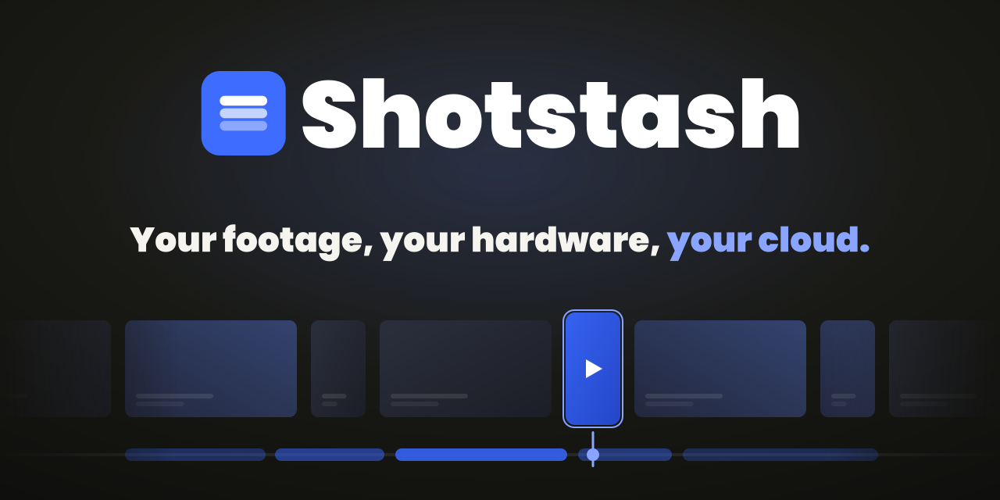
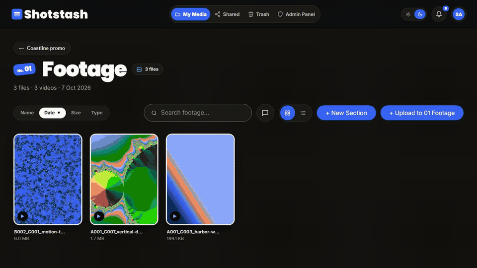
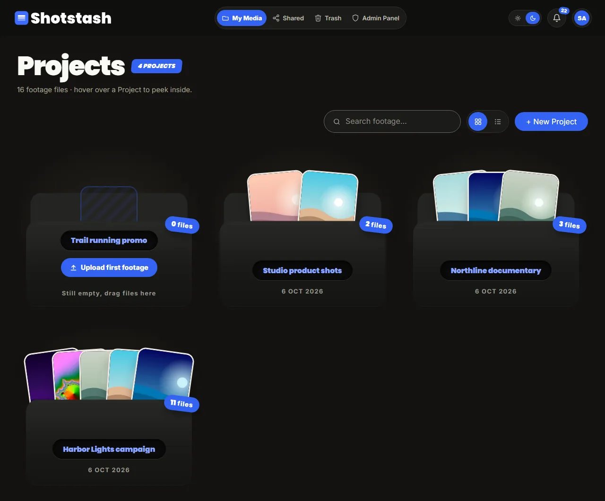
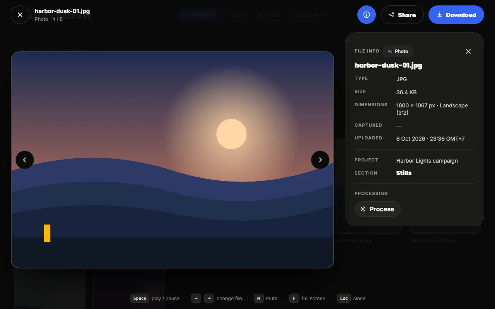
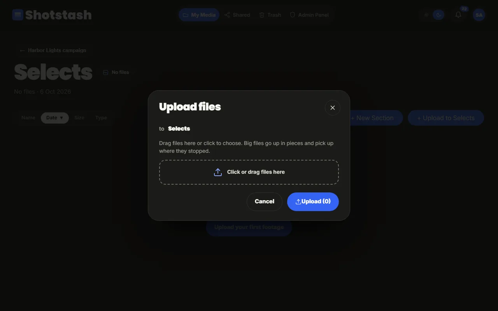
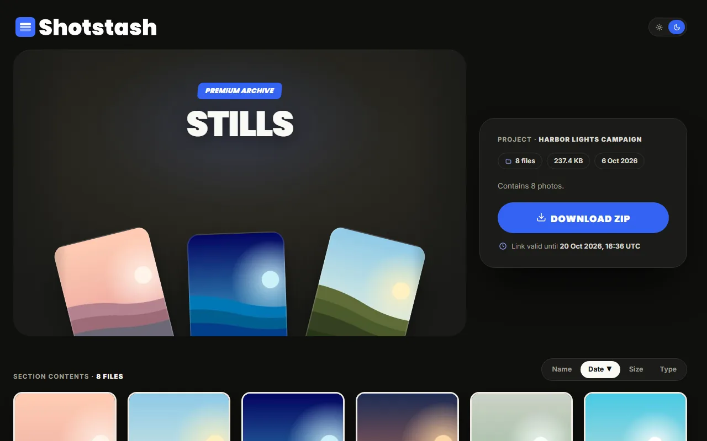

<p align="center">
  
</p>

<p align="center"><b>Your footage, your hardware, your cloud.</b><br>A self-hosted media cloud for creators and small teams, on the PC, NAS or spare drive you already own.</p>

<p align="center">
  <a href="https://github.com/Aldyernesto/shotstash/actions/workflows/pr.yml"></a>
  <a href="https://github.com/Aldyernesto/shotstash/releases"></a>
  <a href="LICENSE"></a>
  <a href="https://aldyernesto.github.io/shotstash/"></a>
</p>

```bash
git clone https://github.com/Aldyernesto/shotstash.git && cd shotstash && sh docker/init.sh && docker compose up -d
```

Then open `http://localhost:3005` and create the owner account. Linux x64 with Docker; the [quick start](https://aldyernesto.github.io/shotstash/docs/quick-start/) covers WSL2, macOS and LAN access.

**[Try the live demo](https://demostash.aldyernesto.my.id)**: read-only accounts (credentials on the sign-in page), resets every night.

<p align="center">
  
</p>

Born in production: it has run a real media library with thousands of files every day since 2026. **MIT licensed. No paid tier, no locked features, nothing held back.**

**[Documentation](https://aldyernesto.github.io/shotstash/)**: quick start, configuration, storage, networking, backup and upgrades, the GraphQL and REST reference, the worker contract, the architecture and an illustrated user guide.

## Why not Immich, PhotoPrism or a DAM?

- **Immich, PhotoPrism and Ente** are personal photo libraries: great for a phone's camera roll, not for delivering project footage to a client.
- **ResourceSpace and Pimcore** are enterprise DAMs: heavy, and built for procurement, not for a two-person studio.
- **Clapshot and FreeFrame** review clips; they do not store and share a whole library.

Shotstash sits in the gap: **video-first storage and sharing for work**, on hardware you already have. It is not a Frame.io-style review tool, not a camera-roll backup, and has no mobile app in v1.

## What you get

| | |
| --- | --- |
|  |  |
|  |  |

- **Projects, sections, files** with 3D folder cards, grid and list views, sort and search.
- **Uploads that survive bad Wi-Fi**: parallel parts with retries, resumable after a reload or a dropped connection, checksum-verified, with duplicate detection per project.
- **Your storage**: a local disk, a NAS mount, or any S3-compatible bucket (AWS S3, Cloudflare R2, MinIO, RustFS, SeaweedFS). See [docs/storage.md](docs/storage.md).
- **A viewer that respects portrait video**: the file's real aspect ratio, custom video controls, keyboard navigation, an info panel.
- **Share links** per file, section or project, public or private, with a clean client page and ZIP download.
- **Roles** for the people you work with: super admin, admin, crew, editor, viewer; account approval; email password reset.
- **Bring your own AI**: a small job contract (queue, heartbeat, progress, output) for your own worker in any language. A reference worker that makes 720p proxies is included.
- **An API for everything**: GraphQL over HTTP and WebSocket ([`schema.graphql`](schema.graphql)) plus REST for uploads, media, sharing, workers and health ([`openapi.json`](openapi.json), OpenAPI 3.1). Both are generated and checked in CI.
- **No telemetry.** Nothing calls home.

Stack: Next.js 16, React 19, TypeScript, Apollo GraphQL with graphql-ws, Prisma 7, PostgreSQL, Dragonfly or Redis, ffmpeg and sharp, Docker.

## Quick start (Docker Compose)

The short version follows; the [full quick start](https://aldyernesto.github.io/shotstash/docs/quick-start/) adds platform notes and troubleshooting.

Linux x64 is the primary platform; linux/arm64 images are built too, on a best-effort basis. WSL2 on Windows and macOS with Docker Desktop work as well. You need Docker Engine with the Docker Compose plugin, git, and about 2 GB of free memory. The first start builds the app image, which takes a few minutes; official images arrive with the first release.

```bash
git clone https://github.com/Aldyernesto/shotstash.git
cd shotstash
sh docker/init.sh      # creates .env with random secrets, then checks Docker, the secrets and the port
docker compose up -d
```

`docker/init.sh` copies `.env.example` to `.env` and fills `SESSION_SECRET`, `MEDIA_SIGNING_SECRET`, `SETUP_TOKEN`, `WORKER_BOOTSTRAP_TOKEN` and `POSTGRES_PASSWORD` with random values (it never prints them and never overwrites an existing `.env`), then runs `docker/preflight.sh`. By hand instead: `cp .env.example .env`, set each of those five to its own `openssl rand -hex 32`, and run `sh docker/preflight.sh`.

`POSTGRES_PASSWORD` is fixed when the database is first created: changing it in `.env` later does not change the database, and the app can no longer connect (keep the first value, or start over with `docker compose down -v`).

Set `APP_URL` in `.env` to the address people open, because emails and share links use it: `http://192.168.1.20:3005` for a server on your LAN, or `https://media.example.com` behind a domain. Left empty, it is `http://localhost:3005`, which only works on the server itself. Run `docker compose up -d` again after changing it.

Open `http://localhost:3005` (or `http://<server-ip>:3005`). You land on `/setup`, which creates the owner account and asks for the `SETUP_TOKEN` from `.env` (`grep SETUP_TOKEN .env`), so nobody else can claim a fresh instance. `docker compose ps` shows the services; the app is ready when it reports `healthy`.

What runs: `app` (Shotstash with ffmpeg), `db` (PostgreSQL 17), `cache` (Dragonfly) and `worker` (the reference processing worker, which makes 720p proxies of videos). Only the app is published on the host; the database, cache and worker are reachable only inside the compose network. Media files live in `./data/media` next to the compose file; the database lives in the `db-data` volume. Database migrations run automatically every time the app starts.

**Configuration.** Every setting is an environment variable in `.env`, read when the app starts: change it and run `docker compose up -d` again, no rebuild. The full list, with defaults: [docs/configuration.md](docs/configuration.md). The app refuses to start when a value is wrong and names each bad variable in `docker compose logs app`.

**Processing workers.** The bundled `worker` registers with `WORKER_BOOTSTRAP_TOKEN` and makes 720p H.264/AAC proxies (`shotstash/proxy-720p`) through the worker contract; it never touches storage or the database. Writing your own worker (transcription, scene detection, anything) in any language: [docs/byo-ai.md](docs/byo-ai.md).

**Storage.** Media goes to `./data/media` by default. To use an S3-compatible bucket instead (AWS S3, Cloudflare R2, MinIO, RustFS, SeaweedFS), set `STORAGE_BACKEND=s3` and the `S3_*` variables: [docs/storage.md](docs/storage.md).

**Media folder permissions.** The app runs as uid 1000 and fixes the owner of `./data/media` at start. On NFS with `root_squash` or on a CIFS/SMB share it cannot, and the app stops with a message: on the host, make the folder writable by uid 1000 (`sudo chown -R 1000:1000 ./data/media`, or mount the share with `uid=1000,gid=1000`).

**Port already taken.** `docker/preflight.sh` tells you. Set `SHOTSTASH_PORT=8080` (any free port) in `.env`, set `APP_URL=http://localhost:8080` to match, and start again.

**Search (optional).** `docker compose --profile search up -d` adds Elasticsearch (about 1 GB of memory); then set `ELASTICSEARCH_NODE_URL=http://elasticsearch:9200` in `.env` and run `docker compose up -d`. Without it, search runs in PostgreSQL. Both answer the same results (Elasticsearch only narrows the candidates); after enabling it on an existing install, run `npm run search:reindex` once.

**Behind a reverse proxy or tunnel.** Set `APP_URL` to the public `https://` address and `TRUST_PROXY=true`, and only when the app is reachable through the proxy alone. Caddy, nginx, Tailscale and Cloudflare Tunnel examples: [Networking](https://aldyernesto.github.io/shotstash/docs/networking/).

**WSL2 (Windows).** Run everything inside the Linux distribution and keep the checkout in the Linux file system (for example `~/shotstash`), not under `/mnt/c`: files on the Windows drive are slow and their permissions do not map, so uploads and the database suffer. Docker Desktop with the WSL2 backend, or Docker Engine installed in the distribution, both work. Open the app at `http://localhost:3005` from Windows.

**macOS (Docker Desktop).** Keep the checkout inside a folder Docker Desktop shares (your home folder is shared by default; see Settings, Resources, File sharing). Give Docker at least 4 GB of memory in Settings, Resources when you build the image or use search.

### Logs, upgrades and backups

- **Logs:** `docker compose logs -f app`. The app writes one JSON line per event.
- **Status:** a super admin can open `/status` for the version, storage, database, cache, live workers and queued jobs. `GET /api/health` answers `{ ok, setupRequired, version }` for monitoring.
- **Official images (after the first release):** every release publishes `ghcr.io/aldyernesto/shotstash` and `ghcr.io/aldyernesto/shotstash-worker` for linux/amd64 and linux/arm64, tagged `X.Y.Z`, `X.Y` and `latest`. Until the first release is out these do not exist yet and compose builds both images locally. Once they do, add the override file [`docker-compose.images.yml`](docker-compose.images.yml) to every compose command, which uses the published images instead of building (`IMAGE_TAG` in `.env` picks the release, default `latest`): `docker compose -f docker-compose.yml -f docker-compose.images.yml pull`, then the same with `up -d`. Details, pinning and rollback: [docs/releasing.md](docs/releasing.md).
- **Upgrade:** `git pull && docker compose up -d --build` ([upgrading and rollback](https://aldyernesto.github.io/shotstash/docs/upgrading/)). **Upgrade note (processing worker):** before pulling a version with the `worker` service, add `WORKER_BOOTSTRAP_TOKEN` to your existing `.env` (`openssl rand -hex 32`, its own value); docker compose refuses to start without it. Once images are published, upgrading becomes `docker compose pull && docker compose up -d`.
- **Rollback:** check out the previous release tag and run `docker compose up -d --build` (with published images: pin the previous image tag). Every migration stays compatible with the previous release, so the older version still runs on the upgraded database. Before v1.0.0 databases are throwaway: a pre-release upgrade may ask you to start with an empty database. **Upgrade note (storage keys):** from migration `0006_storage_keys_uploads` on, files live under hierarchy-free keys and old bytes are not moved; reset pre-1.0 development data after upgrading (empty database and `./data/media`, see [docs/storage.md](docs/storage.md)).
- **Backup:** stop the app and the worker first so files and database match (`docker compose stop app worker`), dump the database with `docker compose exec -T db pg_dump -U shotstash shotstash > shotstash.sql`, copy `./data/media` and `.env`, then `docker compose start app worker`.
- **Restore:** into an empty database, before the app runs; the order matters. The full procedure, which CI rehearses on every change: [Backup and restore](https://aldyernesto.github.io/shotstash/docs/backup/).
- **Stop:** `docker compose down` keeps your data; `docker compose down -v` also deletes the database volume.

## Development

Requires Node.js 24.

```bash
npm install
cp .env.example .env   # set SESSION_SECRET (openssl rand -hex 32); see docs/configuration.md
npx prisma generate
npm run dev:db      # embedded PostgreSQL (PGlite) on port 55433; keep it running
npx prisma migrate deploy   # in a second terminal: apply the migrations
npm run dev:seed    # then create the development accounts (refuses NODE_ENV=production)
npm run dev         # app on http://localhost:3005
```

A fresh install without the seed starts at `/setup`: until the first super admin exists, every page redirects there and `/api/*` and `/media/*` answer `503 SETUP_REQUIRED`. The wizard checks that the storage backend is writable (the `STORAGE_LOCAL_ROOT` folder, or the S3 bucket) and creates the owner account. Whoever submits it first becomes the super admin: set `SETUP_TOKEN` (the form then asks for it) or finish setup before exposing the instance. `GET /api/health` answers `{ ok, setupRequired, version }`; from the server itself (loopback) or with a super admin session it also reports version, database, cache, storage and `schemeMismatch`.

Public demo instances: [Run a public demo](https://aldyernesto.github.io/shotstash/docs/demo/) (`docker-compose.demo.yml`, `node dist/demo.js seed` or `reset` in the image, `npm run demo:seed` and `npm run demo:reset` from source). Trashed items are deleted for good after `SHOTSTASH_TRASH_RETENTION_DAYS` (default 30) by an hourly sweeper.

Before you push, run the same checks CI runs:

```bash
npx prisma generate
npm run lint
npm run typecheck
npm run check:tokens && npm run check:legacy && npm run brand:css -- --check
npm run security:matrix -- --check    # docs/security/route-matrix.md matches the code
npm run i18n:check                   # no Indonesian leftovers anywhere in src or messages
npm run env:example:check            # .env.example and docs/configuration.md match src/lib/config.ts
npm run sdl:check                    # schema.graphql matches src/graphql/schema.ts, every member described
npm run openapi:check                # openapi.json matches the route annotations and validates as 3.1
npm run audit:check                  # no unlisted high or critical advisory (audit-allowlist.json)
npm test
node scripts/privacy-scan.mjs --all   # uses gitleaks when installed
npm run build                         # next build plus the compiled server (dist/server.js)
```

Configuration lives in one place, `src/lib/config.ts`: add a variable to its table, run `npm run env:example`, and read it with `config()`. Lint rejects `process.env` anywhere else in `src/` and `server.ts` (`process.env.NODE_ENV` excepted). `npm start` runs the compiled server after `npm run build`.

Local end-to-end checks (not in CI). First-run setup on an empty database: `npm run dev:db:reset`, `npm run dev:db`, `npx prisma migrate deploy`, `npm run dev`, then `npm run e2e:setup` (gate redirect and 503, setup, concurrent 409, redirect after setup). Security: with `npm run dev:db`, `npx prisma migrate deploy`, `npx tsx prisma/seed.ts` and `npm run dev` running, `npm run e2e:security` exercises login, cookie media, signed shares, access codes, role checks, rate limits, security headers, health and the trash lifecycle (start the server with `EMAIL_TRANSPORT=log` to include the reset-limit rows; login limits mean a second run needs 15 minutes or a server restart) against `http://localhost:3005` (override with `E2E_BASE_URL`). `e2e:security` also covers uploads: parts, resume, wrong checksums, duplicates, cancel and expiry. `npm run e2e:upload` uploads a 256 MiB synthetic file through a proxy that cuts the connection twice and checks it resumes and arrives intact (`E2E_UPLOAD_MB` changes the size). `npm run e2e:pipeline` exercises the job queue and the worker contract (concurrent claims, kind filter, requeue after missed heartbeats, late completion, cancel race, Range input, output and complete, failures); start the server with `WORKER_BOOTSTRAP_TOKEN` set and `SHOTSTASH_PIPELINE_SWEEP_SECONDS=2`, and run the script with the same token. `npm run test:s3` runs the storage contract against an S3-compatible server (see [docs/storage.md](docs/storage.md)). They refuse to run unless the base URL and `DATABASE_URL` point at localhost, and they write test data into that database.

Every route handler is wrapped in `defineRoute({ auth })` and every GraphQL root field has an entry in `src/graphql/auth-map.ts`; the generated table lives in [docs/security/route-matrix.md](docs/security/route-matrix.md). Media bytes are served only under `/media/*` with an HttpOnly session cookie or a signed share URL; `MEDIA_SIGNING_SECRET` signs those URLs.

All UI text lives in `messages/en.json` (next-intl, English only in v1). How to add a locale, the translation checks and the copy rules: [docs/i18n.md](docs/i18n.md).

Product name, logo and brand colors live in `src/lib/brand.ts`. The identity is blue: the three-bar mark (`#3d6cff`) and a UI accent family (`accent` `#3563f2` with white text) documented in [docs/design/DESIGN.md](docs/design/DESIGN.md). To rebrand: edit `src/lib/brand.ts`, replace the SVG sources in `public/brand/` (`icon.svg`, `logo-on-dark.svg`, `logo-on-light.svg`, `og.svg`), run `npm run brand:assets` (copies the favicon to `src/app/icon.svg` and renders `logo.png`, `og.png` and `src/app/apple-icon.png` with sharp), then `npm run brand:css`.

## Contributing and releases

Read [CONTRIBUTING.md](CONTRIBUTING.md) and the [code of conduct](CODE_OF_CONDUCT.md). Commits follow [Conventional Commits](https://www.conventionalcommits.org/) (`feat:`, `fix:`, `docs:`, `feat!:` for a breaking change); see [CONTRIBUTING.md](CONTRIBUTING.md). Releases are cut by merging the release PR that release-please keeps open; how that works, what gets published and how to roll back: [docs/releasing.md](docs/releasing.md). Every release is listed in the [changelog](https://aldyernesto.github.io/shotstash/docs/changelog/). Security issues: [SECURITY.md](SECURITY.md).

The docs site is a separate app in `docs/` (its own `package.json`): `npm ci --prefix docs`, then `npm run dev --prefix docs` serves it on `http://localhost:3100`. Guides that live as Markdown in the repository (`docs/*.md`, `CONTRIBUTING.md`, `SECURITY.md`) are pulled into the site at build time, so edit them where they are.

## License

MIT. See [LICENSE](LICENSE).
