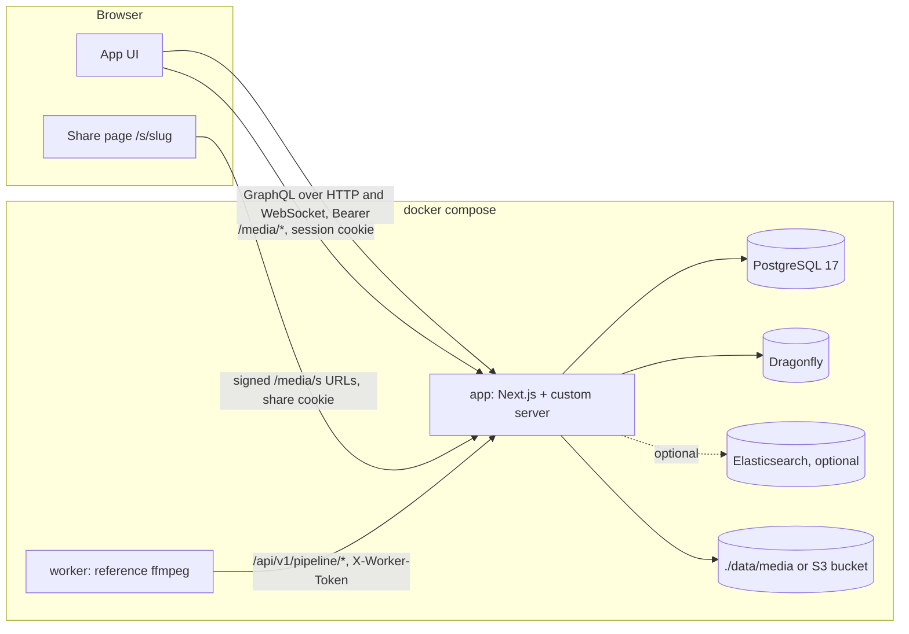
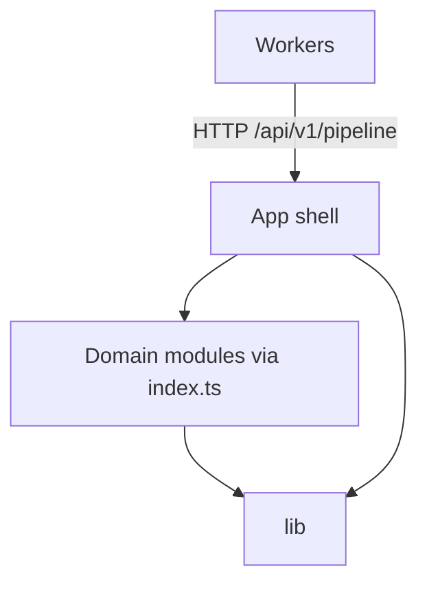
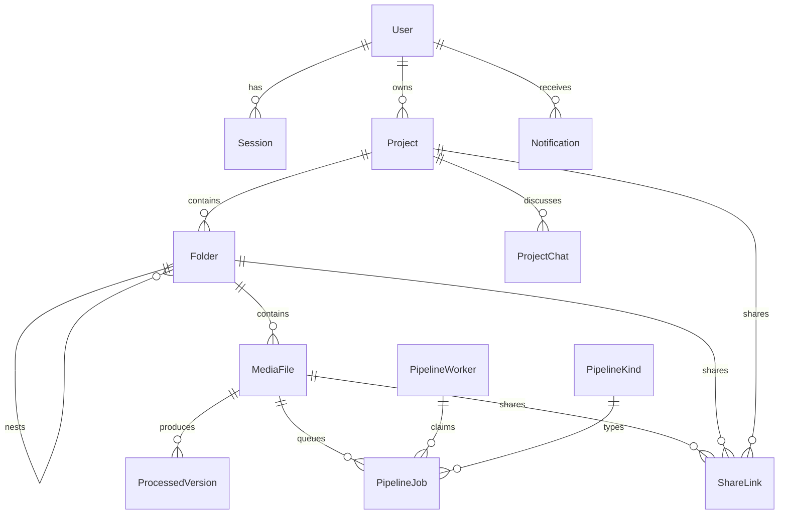

Shotstash is a **modular monolith**: one Next.js application owns every capability through domain modules with explicit public surfaces, and the only out-of-process extension point is a versioned HTTP contract for processing workers. This page is the map for contributors. Each architecture decision has an anchor (`#ad-1` to `#ad-16`) that code comments and pull requests can link to.

## The shape of the system

One container runs the app: the Next.js App Router plus a small custom Node server (`server.ts`) that adds GraphQL subscriptions over WebSocket and the security headers. PostgreSQL holds every record, including the job queue. Dragonfly (Redis-compatible) holds rate-limit windows, locks and the realtime event bus. Bytes live in one storage backend: a directory or an S3-compatible bucket.

## Layers

| Layer | Lives in | May depend on |
| --- | --- | --- |
| App shell: pages, route handlers, GraphQL wiring, custom server | `src/app/`, `src/graphql/`, `server.ts` | module surfaces, `src/lib` |
| Domain modules | `src/modules/<domain>/` | their own files, `src/lib`, other modules through their `index.ts` |
| Lib: pure helpers (config, brand, request facts, errors, logger) | `src/lib/` | nothing above it |
| Workers: the reference worker and anyone else's | `worker/`, external | the pipeline routes only |

The modules today: `activity`, `auth`, `errors`, `i18n`, `library`, `media`, `pipeline`, `realtime`, `setup`, `share`, `storage`, `trash` and `upload`. Some older code still lives in `src/services/`; it is listed in `eslint/legacy-allowlist.json`, a list that may only shrink.

## Data model

Sections in the UI are folders. Files are created when an upload starts (status `uploading`) and become `ready` when it completes.

## Decisions

### AD-1: An independent product [#ad-1]

Shotstash began as a one-time extraction of a production codebase into this repository, with a fresh history and a single initial migration. It shares no code, history or roadmap with any other project, and nothing flows in either direction. Databases created before 1.0.0 are throwaway, and the upgrade notes say so when it matters.

### AD-2: Module boundaries and dependency direction [#ad-2]

Every module exports only through `src/modules/<domain>/index.ts`; other code may import that surface, never a module's internals. Modules never import from `src/app`, `src/components`, `src/graphql` or `src/services`, and `src/lib` imports nothing from modules. Route handlers and resolvers hold no business rules: they validate input, call a module, and map the result. ESLint enforces the direction in CI.

### AD-3: One storage interface, one backend per installation [#ad-3]

All bytes (originals, thumbnails, covers, processed versions, upload parts) go through one `StorageBackend` interface in `modules/storage`, with a `local` implementation and an `s3` implementation selected once by `STORAGE_BACKEND`. Keys never encode the folder hierarchy (`files/<fileId>/original.<ext>`, `files/<fileId>/thumb-<n>.jpg`, `files/<fileId>/proc/<versionId>.<ext>`, `covers/<kind>/<id>.jpg`), are recorded on their rows and never recomputed, so moving a file never moves bytes. Originals are immutable; any conversion is a pipeline job that produces a processed version. A partial unique index on the project and checksum of ready files is the duplicate authority. ZIP downloads stream in STORE mode. Browsers never get presigned bucket URLs: the app streams bytes so authorization stays in the app. See [Storage](/docs/storage/).

### AD-4: One session, carried two ways; bytes leave only through /media [#ad-4]

`POST /api/v1/auth/login` issues one session token, used as a Bearer token for `/api/graphql` and `/api/v1/*`, and as the `shotstash_session` cookie, which the browser sends to the media routes under `/media` only. Tokens never travel in query strings. Whether the cookie is marked secure follows the observed request scheme, not `APP_URL`. Every route handler declares its auth mode (`session`, `cookie`, `worker`, `signed` or `public`) through `defineRoute()`; a test fails on any route without one, and the generated table is committed as `docs/security/route-matrix.md`. Share pages get short-lived HMAC-signed media URLs; private links are unlocked with an access code that sets a signed cookie scoped to the share path.

### AD-5: Authorization is one function [#ad-5]

The permission matrix lives once, in `can(actor, action, resource)` in `modules/auth/permissions.ts`. Every mutating resolver and route calls it; read paths scope their queries with it; every fan-out (notifications, mention candidates, subscriptions) applies it for the recipient as well as the actor. The UI reads permissions derived from the same function and never re-implements the rules. Roles: super admin, admin, crew, editor and viewer; a read-only flag denies every write (used by demo accounts). A table-driven test covers every role and action.

### AD-6: The job queue is PostgreSQL; the worker contract is versioned REST [#ad-6]

Jobs live in `pipeline_jobs`. A kind (`namespace/name`) can be queued only when a worker registered it or it is built in. A worker claims the oldest queued job of its registered kinds with a single `FOR UPDATE SKIP LOCKED` statement, gets a claim token, and sends it with every later call; a stale token answers `409`. The heartbeat time is the only lease: an in-app sweeper requeues claims silent for 90 seconds and fails a job after three attempts. Workers read the input through a Range-capable route and upload one output with `PUT`, which becomes a processed version on `complete`. Workers never hold storage or database credentials. Breaking changes bump the path version. See [Bring your own AI](/docs/byo-ai/).

### AD-7: Realtime through graphql-ws and Dragonfly, ordered by seq [#ad-7]

Subscriptions (discussion, notifications, job progress) run over graphql-ws on the custom server. Events are published to Dragonfly channels after the database commit and carry a per-row `seq`; clients drop anything older than what they have seen. Authorization is checked at subscribe time and again per event. A second app process needs no code change: CI runs two and checks that events cross between them.

### AD-8: Docker Compose runtime; images carry no environment [#ad-8]

`server.ts` is compiled with esbuild to `dist/server.js`, with every dependency external. No public build-time variable exists: the browser reads public settings from `GET /api/v1/config`, so one image serves every installation. The image runs migrations and then the server as a non-root user. Compose defines the app, PostgreSQL 17, Dragonfly, the reference worker and an optional Elasticsearch profile. Releases publish multi-arch images to the GitHub Container Registry. Logs are one JSON line per event; there is no telemetry.

### AD-9: First-run setup gate, no seeded credentials [#ad-9]

Until the singleton `instance_settings` row records a completed setup, pages redirect to `/setup` and `/api/*` and `/media/*` answer `503 SETUP_REQUIRED`, so workers wait instead of crash-looping. Setup creates the first super admin in one transaction; a concurrent submission gets `409`. There are no default accounts, and development seeds refuse to run in production.

### AD-10: next-intl, English source, no locale routing [#ad-10]

All text comes from `messages/<locale>.json`; English is the source and the only locale shipped in v1. The locale follows the user's choice, then `SHOTSTASH_DEFAULT_LOCALE`, then English, without URL prefixes. Code outside requests (emails, the sweeper) translates with an explicit locale. API errors carry a stable `code` that the UI translates. See [Translations](/docs/contributing/i18n/).

### AD-11: Brand is one module [#ad-11]

`src/lib/brand.ts` is the single source of the product name, logos and brand colours; CSS custom properties are generated from it and the design spine mirrors it. Rebranding a fork means editing that file and the files in `public/brand/`.

### AD-12: Privacy scanner with a hashed denylist [#ad-12]

Every push and pull request runs gitleaks for secrets and a scanner that hashes every phrase of every line and compares it with a list of hashes. The list bans terms without revealing them; a canary term proves the scanner runs.

### AD-13: Docs from committed artifacts, published statically [#ad-13]

The docs are a separate Fumadocs app in `docs/` with its own dependencies. They read only committed files: the guides, `schema.graphql` and `openapi.json`, which CI regenerates and diff-checks, so the API reference cannot drift from the code. The `docs.yml` workflow deploys the static export to GitHub Pages under the project path, or at the root of a custom domain when one is configured. Try-it consoles stay off until a public demo instance exists.

### AD-14: CI and releases [#ad-14]

The CI workflow runs lint (including the import direction), type checks, the generated-file checks, a dependency audit with an expiring allowlist, unit tests on `node --test`, the privacy scan, the build, image builds for amd64 and arm64 on native runners, a Docker Compose boot with a backup and restore rehearsal, S3 contract tests and end-to-end upload, pipeline and realtime tests. Releases come from release-please: merging its release PR tags `vX.Y.Z`, writes the changelog and, after CI passes on that commit, publishes the app and worker images.

### AD-15: Edge hardening in one place [#ad-15]

`src/lib/request.ts` is the only reader of forwarded headers and honours them only with `TRUST_PROXY=true`. `src/lib/rateLimit.ts` is the only throttle: sliding windows on Dragonfly, keyed by IP, account or worker, with the limits defined in that file. The custom server sets the security headers for every response, with `Strict-Transport-Security` only over HTTPS. See [Networking](/docs/networking/).

### AD-16: Trash, deletion and links [#ad-16]

Trashing marks the item and every descendant in one transaction; every read path (library, search, duplicates, share pages, media routes, job claims) ignores trashed items, and trashing a file cancels its unfinished jobs. A share link targets exactly one file, folder or project; a trashed target makes its page answer "inactive". Permanent deletion revokes every link to the item before deleting bytes. An hourly sweeper empties the Trash after 30 days by default.

## Conventions

| Concern | Convention |
| --- | --- |
| Configuration | `src/lib/config.ts` is the only reader of the environment; `.env.example` and the [configuration page](/docs/configuration/) are generated from it |
| Errors | `{ code, message }` with stable codes; GraphQL errors carry the code in `extensions` |
| Ids and time | UUID v7 for new rows; timestamps in ISO 8601 UTC; byte sizes as `BigInt` strings in GraphQL |
| API surface | GraphQL for the app UI; REST for login, uploads, media, share pages, the worker contract, config and health |
| Tests | `node --test` for units; end-to-end scripts against a running app in CI |

## Deferred

A nonce-based Content Security Policy, horizontal scaling beyond the wired pub/sub, backup automation, a plugin registry beyond the worker contract, and server-side media dimensions are deliberately out of v1.
